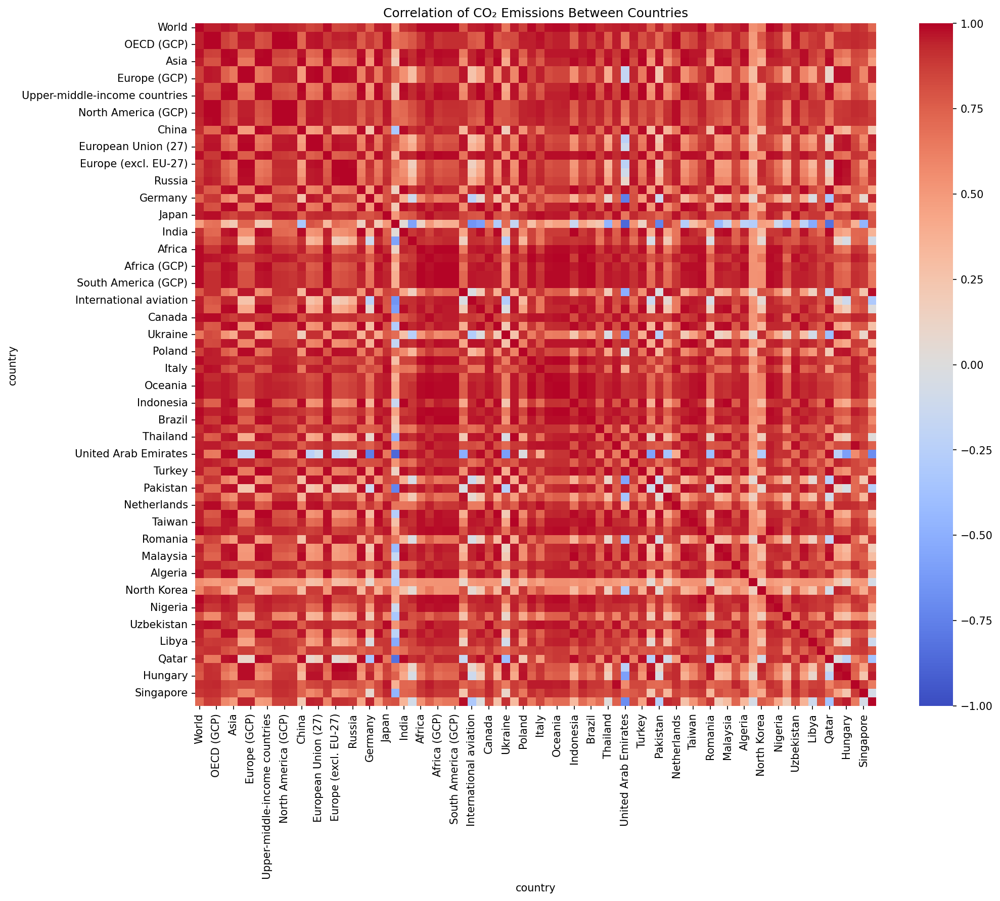

# DataVisualizationUsingSeaborn

Using Seaborn library to efficiently draw out important insights by plotting different types of graphs and charts.

## Dataset

**Source:** [CO₂ Emissions Across Countries, Regions and Sectors](https://www.kaggle.com/datasets/shreyanshdangi/co-emissions-across-countries-regions-and-sectors?resource=download)

This project analyzes CO₂ emissions data from countries worldwide, providing comprehensive visualizations to understand emission patterns, trends, and relationships.

## Setup

1. Put your original file as `Data.csv` in project root.
2. Install requirements: `pip install -r requirements.txt`.
3. Run `python run_all.py` to generate cleaned data and all visualizations.

## Outputs

- **Cleaned long-format CSV:** `data/clean_co2_emissions.csv`
- **Figures:** `outputs/figures/*.png`
- **Country features with cluster labels:** `outputs/country_features_with_clusters.csv`

## Visualizations

### 1. Top CO₂ Emitters (2023)

**Summary:** This horizontal bar chart shows the top 15 countries with the highest total CO₂ emissions in 2023. China typically leads with the highest emissions, followed by the United States, India, and other major economies. This visualization helps identify the primary contributors to global CO₂ emissions and provides context for international climate policy discussions.

### 2. CO₂ Emissions Trends of Top 10 Emitters

**Summary:** This line plot tracks the emission trends of the top 10 emitting countries over time. It reveals how different countries' emissions have evolved, showing patterns like rapid industrialization (China's steep rise), stabilization (US plateau), and varying growth rates across different economies. The visualization helps identify emission trajectories and potential policy impacts.

### 3. Distribution of CO₂ Emissions

**Summary:** This histogram with kernel density estimation shows the distribution of CO₂ emissions across all country-year observations. The plot typically reveals a right-skewed distribution, indicating that most countries have relatively low emissions while a few countries contribute disproportionately high amounts. This helps understand the global emission landscape and identify outliers.

### 4. CO₂ Emissions Boxplot by Year

**Summary:** This boxplot visualization shows the distribution of CO₂ emissions across countries for each year. It reveals trends in global emission patterns, including median values, quartiles, and outliers. The plot helps identify years with significant changes in global emission patterns and shows the evolution of emission inequality between countries over time.

### 5. Missing Data Heatmap

**Summary:** This heatmap visualizes missing data patterns in the CO₂ emissions dataset, with years on the y-axis and countries on the x-axis. Dark areas indicate missing data points. This visualization is crucial for data quality assessment, helping identify which countries have incomplete historical records and which time periods lack comprehensive coverage.

### 6. Country Correlation Heatmap

**Summary:** This correlation heatmap shows the relationships between CO₂ emissions of different countries over time. Red areas indicate positive correlations (countries with similar emission patterns), while blue areas show negative correlations. This helps identify countries with similar economic development patterns, regional similarities, or shared policy influences.

### 7. Rolling Average Trend for China

**Summary:** This line plot shows China's CO₂ emissions trend with both annual data points and a 5-year rolling average. The rolling average smooths out year-to-year fluctuations to reveal underlying trends. This visualization is particularly useful for understanding China's rapid industrialization and recent emission patterns, including any signs of stabilization or decline.

### 8. Percentage Change Analysis (1990-2023)

**Summary:** This horizontal bar chart shows the top 12 countries with the highest percentage change in CO₂ emissions from 1990 to 2023. It highlights countries that have experienced the most dramatic increases in emissions, often reflecting rapid economic development, industrialization, or population growth. This helps identify emerging emission hotspots and countries that may need targeted climate interventions.

### 9. PCA + K-Means Clustering

**Summary:** This scatter plot shows countries clustered based on their CO₂ emission characteristics using Principal Component Analysis (PCA) and K-Means clustering. Countries are grouped into 4 clusters based on features like total emissions, mean emissions, emission variability, and data coverage. The top 10 emitting countries are labeled for reference. This visualization helps identify groups of countries with similar emission profiles, which can inform regional climate policies and international cooperation strategies.

## Notes

- Sector-level analysis was removed because the uploaded dataset doesn't include sector columns.
- Many plots automatically pick the latest year found in the data; change parameters inside scripts if you want other years.
- The analysis focuses on total CO₂ emissions rather than per-capita emissions, providing insights into absolute emission contributions.
- All visualizations use consistent color schemes and formatting for professional presentation.

## Technical Details

- **Data Processing:** Raw data is cleaned and standardized using pandas
- **Visualization:** All plots created using Seaborn and Matplotlib
- **Machine Learning:** PCA and K-Means clustering for country grouping
- **Output Format:** High-resolution PNG files (150 DPI) suitable for presentations and publications